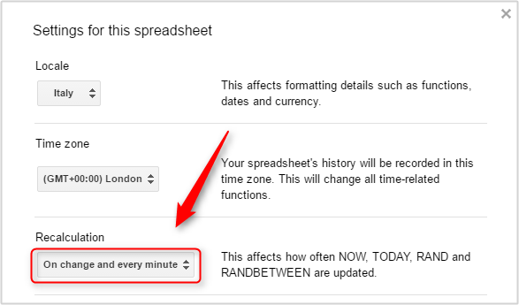
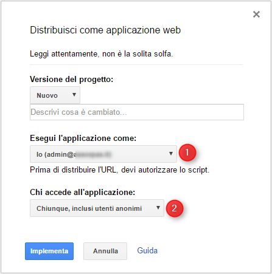
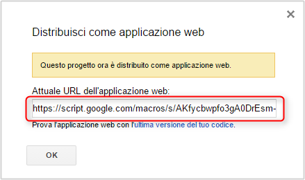

# Creare un feed RSS a partire dai contenuti di una pagina web, utilizzando il foglio elettronico di Google Drive

**Ingredienti**:

- una **pagina web** da cui estrarre i dati.

**Strumenti**:

- un **browser**;
- uno **[Sheet](https://www.google.com/intl/it_it/sheets/about/)**, ovvero il foglio elettronico di Google Drive;
- uno **script** scritto in **Google App Script**.

**Conoscenze propedeutiche**

- una conoscenza di base del linguaggio **HTML**;
- una conoscenza di base dei **feed RSS**;
- una conoscenza di base del linguaggio **XPath**;

**Difficoltà**: bassa

**Tempi di prepazione**: 20 minuti (salvo complicazioni)

**Dosi per**: da 1 a ∞ 

## Preparazione

### L'individuazione degli ingredienti

Si inizia dallo scegliere una pagina da trasformare in un feed RSS. Per questa ricetta, a solo scopo di esempio, utilizzeremo l'**albo Pretorio** del comune di **Bagheria**:

http://comune.bagheria.pa.it/albo-pretorio/albo-pretorio-online/

La parte della pagina che contiene dei dati che si prestano a essere trasformati in un feed RSS è la tabella con gli atti pubblicati in atto, che ha una struttura come quella di sotto:

<table>
<thead>
<tr class="header">
<th align="left">Cronologico</th>
<th align="left">Ente</th>
<th align="left">Numero atto</th>
<th align="left">Oggetto</th>
<th align="left">Inizio</th>
<th align="left">Fine</th>
<th align="left">Categoria</th>
</tr>
</thead>
<tbody>
<tr class="odd">
<td align="left">728/2016</td>
<td align="left">Comune di Bagheria</td>
<td align="left">16</td>
<td align="left"><a href="http://comune.bagheria.pa.it/albo-pretorio/albo-pretorio-online/?ap_id=23619&amp;ap_show=detail">PROVVEDIMENTI URGENTI IN MATERIA DI RANDAGISMO - AFFIDAMENTO DEL SERVIZIO<br>
</a></td>
<td align="left">27/02/2016</td>
<td align="left">13/03/2016</td>
<td align="left">Determinazioni apicali - dirigenziali</td>
</tr>
<tr class="even">
<td align="left">727/2016</td>
<td align="left">Direzione 12. Minori, problematiche giovanili, disabili, dipendenze, sostegno al reddito e contrasto alla povertà, cultura valorizzazione beni culturali.</td>
<td align="left">225</td>
<td align="left"><a href="http://comune.bagheria.pa.it/albo-pretorio/albo-pretorio-online/?ap_id=23618&amp;ap_show=detail">Revoca determina n.33 del 22/01/2016<br>
</a></td>
<td align="left">26/02/2016</td>
<td align="left">12/03/2016</td>
<td align="left">Determinazioni apicali - dirigenziali</td>
</tr>
<tr class="odd">
<td align="left">726/2016</td>
<td align="left">DIREZIONE 7. Gare, Appalti e monitoraggio, patrimonio, sanità, espropri.</td>
<td align="left">48</td>
<td align="left"><a href="http://comune.bagheria.pa.it/albo-pretorio/albo-pretorio-online/?ap_id=23617&amp;ap_show=detail">Liquidazione pagamento canone affitto 2015 "La Pineta srl"<br>
</a></td>
<td align="left">26/02/2016</td>
<td align="left">12/03/2016</td>
<td align="left">Determinazioni apicali - dirigenziali</td>
</tr>
</tbody>
</table>

Per la creazione di un feed RSS gli elementi minimi da creare, e quindi estrarre sono:

- `<title>`, ovvero il titolo;
- `<pubDate>`, ovvero la data di pubblicazione;
- `<link>`, ovvero l'URL dell'elemento.

Per `<title>` e `<pubDate>`, per la tabella del nostro esempio, basterà estrarre rispettivamente il contenuto delle colonne "Oggetto" e "Inizio", ovvero la IV e la V. Per il link, bisognerà "guardare dentro" il codice HTML.
In corrispondenza dell'oggetto degli atti sembra esserci l'URL relativo, quindi bisognerà fare click con il tasto destro del mouse sull'oggetto e poi fare click su ispeziona:


Guardando nel codice si vede una struttura di questo tipo:

```html
<td>
	<a href="http://comune.bagheria.pa.it/albo-pretorio/albo-pretorio-online/?ap_id=23619&amp;ap_show=detail" rel="nofollow">
	PROVVEDIMENTI URGENTI IN MATERIA DI RANDAGISMO - AFFIDAMENTO DEL SERVIZIO																			
	<br>
	</a>								
</td>
```

In questo esempio i dati che ci servono per il `<link>` del feed RSS sono quindi nella proprietà `href` del tag `a` associato ai titoli degli atti pubblicati.

### L'estrazione degli ingredienti

**Goodle Drive sheet** è lo strumento con cui "raccogliere" queste tre informazioni, tramite la funzione nativa [**IMPORTXML**](https://support.google.com/docs/answer/3093342?hl=it).  

La funzione "Importa dati dai vari tipi di dati strutturati, tra cui XML, HTML, CSV, TSV e feed XML RSS e ATOM", e richiede che vengano definite una fonte e una query XPATH. Ad esempio:

    IMPORTXML("https://it.wikipedia.org/wiki/Giochi_olimpici"; "//table[10]/tbody/tr/td[3]")

Nel caso di esempio la fonte è una e le query sono quelle della tabella sottostante:

Query|Descrizione|Elemento estratto
---|---|---
`//tbody/tr/td[4]`|Per la tabella presente, per tutte le righe, soltanto il contenuto delle celle della IV colonna|`<title>`
`//tbody/tr/td[5]`|Per la tabella presente, per tutte le righe, soltanto il contenuto delle celle della V colonna|`<pubDate>`
`//tbody/tr/td[4]/a/@href`|Per la tabella presente, per tutte le righe, soltanto per la IV colonna, la proprietà `href` di tutti i tag `<a>` contenuti|`<link>`

#### Il preparato

Anche per questa ricetta c'è un "preparato" per prendere confidenza e fare in modo che sia "buona la prima".
Per facilitare l'apprendimento abbiamo infatti già "cucinato" uno foglio Gdrive di cui fare una **copia** e raggiungibile [**qui**](https://docs.google.com/spreadsheets/d/1NdMuPWWXriStFn4P45ScYWkopIxTP2IrpIIOYX6Eeao/copy).

Il consiglio è quello di **farne una copia** andando sul menu **File** --> **Crea una copia**: usatela come base per le vostre **ricette future** e anche per **completare questa**.  
Poi, sempre nel menu **File**, selezionare **Imposta Foglio di lavoro** e in "Ricalcolo" nel menù a tendina scegliere "Ad ogni modifica e ad ogni ora".



E' suddiviso in tre fogli: 
- "**raccolta**", in cui vengono inseriti ed eventualmente "mondati" i dati estratti dalla pagina web sorgente;
- "**clean**", in cui sono presenti i soli necessari per la generazione del feed RSS; 
- "**meta**", un foglio in cui inserire alcuni metadati e istruzioni utili alla riuscita della ricetta.


Iniziamo proprio da "**meta**", in cui dovrà essere inserito l'URL della pagina sorgente e le 3 query XPath di sopra. Per questo esempio la sorgente è l'albo del Comune di Bagheria.


Nel foglio "**raccolta**" una riga di intestazione con i nomi di colonna ("title_raw", "pubDate", "href", "title") e nella seconda riga le funzioni per estrarre i valori di nostro interesse. In particolare:

Cella|Funzione
---|---
*A2*|`=IMPORTXML(meta!B1,meta!B3)`
*B2*|`=IMPORTXML(meta!B1,meta!B4)`
*C2*|`=IMPORTXML(meta!B1,meta!B5)`

Queste funzioni produrranno in automatico l'importazione per l'appunto di oggetto, data di pubblicazione e URL dell'atto.


Alle volte è necessario fare un po' di "pulizia", e un foglio elettronico si presta bene per la "mondatura" di testi. Nella colonna "title", la IV, è stata inserita ad esempio una funziona che copia il titolo grezzo della fonte, e rimuove eventuali "andate a capo" presenti nel testo originario. La funzione usata è:

    =REGEXREPLACE(A2,"\n"," ")

Questa e tante altre operazioni propedeutiche alla pubblicazione in RSS possono essere fatte in questo foglio (rimozioni di caratteri non voluti, trasformazione in minuscolo, modifica dello schema della data da gg-mm-aaaa a gg/mm/aaaa, ecc.)

Non resta che importare nel foglio "**clean**" i soli dati necessari per produrre il feed RSS ovvero le colonne A, C e D. Per farlo un modo comodo è quello di usare la funzione [QUERY](https://support.google.com/docs/answer/3093343?hl=it-IT&rd=1), che richiede come argomenti una sorgente dati su cui fare l'interrogazione e la query da eseguire su questa.
Ad esempio, in questo caso, nella cella `A1` del foglio la formula:

    =QUERY(raccolta!A:D,"select D,B,C where C contains 'http'")

Ovvero a partire da tutto il range dei dati compreso tra le colonne "A" e "D" del foglio "raccolta" (`raccolta!A:D`), selezionare tutte le righe le colonne "D","B" e "C" (`select D,B,C`) laddove la colonna "C" contiene la stringa 'http' (`where C contains 'http'`).

### Costruiamo il nostro piatto

Non resta che usare gli ingredienti estratti - titolo, data di pubblicazione e link - e creare il feed RSS.

La creazione del feed avverrà tramite uno script **[Google App Script](https://developers.google.com/apps-script)** creato da [Matteo Fortini](https://twitter.com/matt_fortini), che trovate già dentro il foglio elettronico.

La cosa più comoda è partire 

Questi i passi da seguire:

- copiare l'ID del foglio creato in copia. Si legge nell'URL e in questo esempio è "1NdMuPWWXriStFn4P45ScYWkopIxTP2IrpIIOYX6Eeao"


- fare click nel menu **Strumenti** --> **Editor Script**. Si aprirà lo script creato da Matteo;
- poco dopo una tretina di righe c'è la variabile `ID_SPREADSHEET`. Cancellate l'ID esistente e incollate l'ID copiato prima; 
- fare click sul menu **File** --> **Save**;
- fare click sul menu **Pubblica** --> **Distribuisci come applicazione web**;
- selezionare 1) il vostro indirizzo di posta elettronica in "Esegui 'applicazione come" e 2 "Chiunque, inclusi utenti anonimi" in "Chi accedee all'applicazione";



- fare click sul menu **Risorse** --> **Trigger del progetto corrente** e aggiungere nuovo trigger con cadenza oraria (è quello di default)
- fare click su **Implementa**;
- autorizzare l'applicazione;
- copiare l'URL della finestra che appare;



- incollarlo nel foglio "meta" in corrispondenza di RSS link. **Questo è l'URL del feed RSS**; 


- tornare nello script e fare di nuovo click sul menu **Pubblica** --> **Distribuisci come applicazione web** e poi fare click su **Aggiorna**.


## In conclusione

Avete creato un **feed RSS** a partire da una pagina web su cui avete applicato delle **query XPath**. L'RSS è generato grazie un **Google App Script**.

E' una procedura applicabile a numerossisme pagine web e non solo agli albi pretori. Quello che varierà più frequentemente è la sintassi delle interrogazioni XPath.

Buon divertimento

